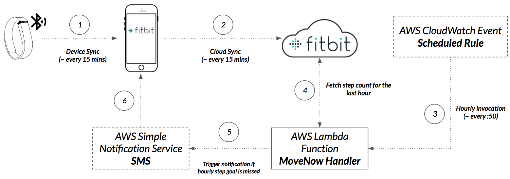

# MoveNow - A Fitbit Notifier

## Why
The reason behind this example was that I needed to have a mechanism for reminding myself to regularly get some steps every hour. While this feature is supported by newer Fitbit devices, my [Fitbit Charge](https://www.fitbit.com/charge#features) was missing the _Reminders to Move_ function. My search to an approach to deploying this service without the need to manage servers etc lead me to giving [AWS Lambda][1] a try. AWS Lambda is a part of the AWS compute offering that lets one run code in response to events without having to provision or manage servers.

## How does it work?
The process for getting the _movenow_ notification occur through two related flows; see diagram below. The first flow pertains to capturing steps data from the Fitbit device. This part is automatically when the device is paired with a smartphone running the Fitbit app. The device will sync periodically (approx. every 15 minutes) with the app and as long as the smartphone is connected to the network it will upload the latest step data to the Fitbit server. 

The second flow is the are that this example tackles. A scheduled rule is created in AWS CloudWatch to invoke the AWS Lambda function on an hourly basis. The AWS Lambda function retrieves step data from Fitbit servers and determines based on the step threshold value if the user needs to be notified. If a notification needs to be sent, then the AWS Lambda function will use AWS Simple Notification Service (SNS) to send an SMS text through a predefined topic in SNS.

These two flows are depicted in the diagram below:    

## Content

The source code is based on a NodeJS package structure and uses NPM to import libraries that facilitate certain core functions. The following are the key files needed 
- [src/lambda.js][2]: The lambda function to transform the payload
- [package.json](package.json): Defines the packaging tasks and the npm modules in use

## Requirement
- Need to create [AWS account](http://docs.aws.amazon.com/lambda/latest/dg/setting-up.html)
- Need to setup [AWS CLI](http://docs.aws.amazon.com/lambda/latest/dg/setup-awscli.html) with the credentials of your AWS account
- NodeJS and NPM need to be installed 
- Need to have an app [registered with Fitbit](https://dev.fitbit.com/apps) in order to use the [Web API](https://dev.fitbit.com/docs/basics/).
- [Obtain an access token from Fitbit to invoke the API](https://dev.fitbit.com/docs/oauth2/). You will want to obtain this token ahead of time (providing it with a large expiration period) as it will be needed to invoke the Fitbit API to obtain step data.

## Setting up the Components
1. Define the [AWS Lambda function][2]
2. [Create Amazon Simple Notification Service (SNS) Topic](http://docs.aws.amazon.com/sns/latest/dg/GettingStarted.html) through the console
3. Create [AWS CloudWatch event rule](http://docs.aws.amazon.com/AmazonCloudWatch/latest/DeveloperGuide/WhatIsCloudWatchEvents.html). The rule should define the frequency of execution through a schedule (_fixed rate_ or Cron expression). The target should be the Lambda function created in _Step 1_  with the _Configure Input_ having a JSON object containing the configuration object (event input values) of the function. 

## Working with the source code
- Clone or fork this repository
- Ensure that you've followed the [Requirements](#requirements) section above
- Run `npm run build` to install dependencies, package the Lambda function and node modules in a zip and finally deploys the Lambda function to AWS using the AWS CLI.

###License

See [LICENSE](LICENSE) for further details.
 

[1]: http://docs.aws.amazon.com/lambda/latest/dg/welcome.html
[2]: ./src/lambda.js
 